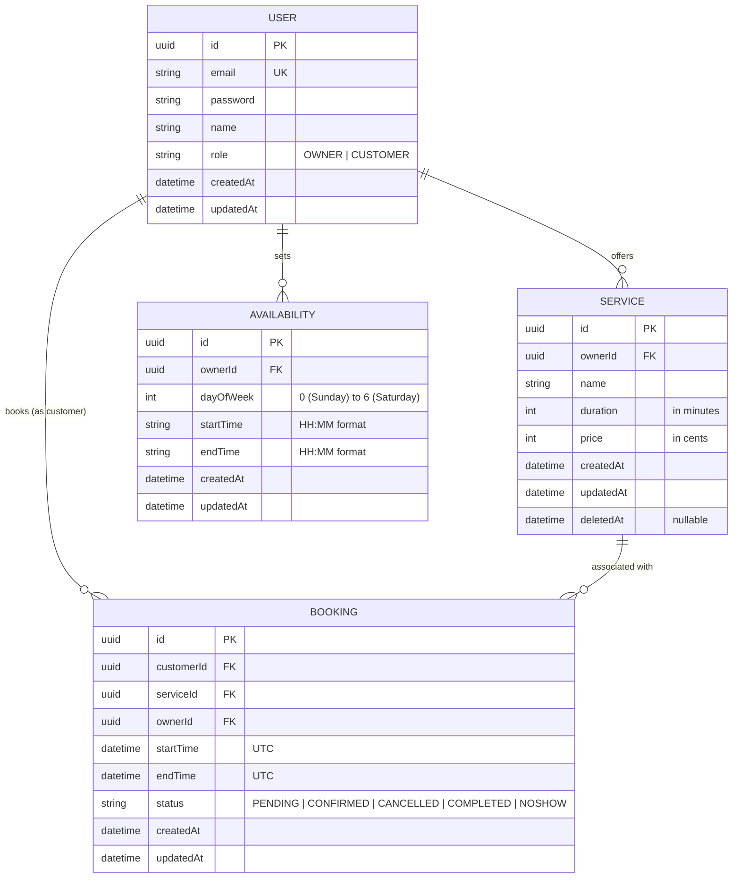

# BookSlot System Design Document

This document outlines the architectural decisions, database models, API specifications, authentication flow, and edge-case handling for **BookSlot**, an appointment booking platform.

---

## 1. Database Schema

The database is built on **PostgreSQL** using **Prisma ORM**. To keep user management simple and centralized while maintaining strict role separation, we employ a unified `User` model with a role enum.



### Table Definitions & Fields

#### 1. `User` Table
Holds both Business Owners and Customers.
*   `id`: `UUID` (Primary Key, default: `gen_random_uuid()`)
*   `email`: `VARCHAR(255)` (Unique index, normalized to lowercase)
*   `password`: `VARCHAR(255)` (Bcrypt hashed password)
*   `name`: `VARCHAR(100)`
*   `role`: `ENUM('OWNER', 'CUSTOMER')`
*   `createdAt` & `updatedAt`: `TIMESTAMP`

#### 2. `Service` Table
Services offered by Business Owners.
*   `id`: `UUID` (Primary Key)
*   `ownerId`: `UUID` (Foreign Key to `User.id`, cascades on delete, index)
*   `name`: `VARCHAR(100)`
*   `duration`: `INTEGER` (Duration of service in minutes, e.g. 30, 60)
*   `price`: `INTEGER` (Price stored in cents to prevent floating point inaccuracies, e.g. $15.50 = 1550)
*   `createdAt` & `updatedAt`: `TIMESTAMP`
*   `deletedAt`: `TIMESTAMP` (Nullable; used for soft delete to preserve historical booking data)

#### 3. `Availability` Table
Defines weekly working hours for Business Owners.
*   `id`: `UUID` (Primary Key)
*   `ownerId`: `UUID` (Foreign Key to `User.id`, cascades on delete, index)
*   `dayOfWeek`: `INTEGER` (Values 0 to 6 representing Sunday to Saturday)
*   `startTime`: `VARCHAR(5)` (Represented in HH:MM format, e.g. "09:00")
*   `endTime`: `VARCHAR(5)` (Represented in HH:MM format, e.g. "17:00")
*   `createdAt` & `updatedAt`: `TIMESTAMP`

#### 4. `Booking` Table
Holds reservations made by Customers.
*   `id`: `UUID` (Primary Key)
*   `customerId`: `UUID` (Foreign Key to `User.id`, restrict delete)
*   `serviceId`: `UUID` (Foreign Key to `Service.id`, restrict delete)
*   `ownerId`: `UUID` (Foreign Key to `User.id`, restrict delete, index)
*   `startTime`: `TIMESTAMP` (UTC start date and time)
*   `endTime`: `TIMESTAMP` (UTC end date and time, auto-calculated as `startTime + service.duration`)
*   `status`: `ENUM('PENDING', 'CONFIRMED', 'CANCELLED', 'COMPLETED', 'NOSHOW')` (default: `'CONFIRMED'`)
*   `createdAt` & `updatedAt`: `TIMESTAMP`

---

### Database Schema Design Justifications
1.  **Unified User Model with Role Enum**: Simplifies authorization guards and JWT validation. Since owners and customers share basic properties (name, email, credentials), single-table inheritance is the cleanest design pattern.
2.  **Price in Cents**: Avoids decimal precision issues inherent in float/double types when adding, subtracting, or rendering currency totals.
3.  **Soft Service Deletion (`deletedAt`)**: Essential so that existing appointments do not crash when pulling their service info, but ensures new customers cannot find or book the service.
4.  **Redundant `ownerId` in Booking**: Denormalized to quickly query a business owner's upcoming schedule without performing a JOIN through the `Service` table.

---

## 2. API Surface

All API responses follow a consistent JSON format:
- **Success**: Return raw object/array or wrapped JSON.
- **Errors**: `{ "statusCode": HTTP_STATUS, "message": "Error details", "error": "Error Name" }`

### Authentication & Profiles
*   `POST /api/auth/register`
    *   **Access**: Public
    *   **Body**: `{ "email": "string", "password": "safe_password", "name": "Name", "role": "OWNER | CUSTOMER" }`
    *   **Response**: `201 Created` with the registered user profile (excluding password).
*   `POST /api/auth/login`
    *   **Access**: Public
    *   **Body**: `{ "email": "string", "password": "safe_password" }`
    *   **Response**: `200 OK` with `{ "accessToken": "JWT_TOKEN" }`.

### Services (Owner Only for Write Operations)
*   `POST /api/services`
    *   **Access**: Registered `OWNER`
    *   **Body**: `{ "name": "Haircut", "duration": 30, "price": 2500 }`
    *   **Response**: `201 Created` with created service object.
*   `GET /api/services`
    *   **Access**: Registered `OWNER` (returns owned services) / Public or `CUSTOMER` (returns all active services)
    *   **Response**: `200 OK` with service array.
*   `PATCH /api/services/:id`
    *   **Access**: Registered `OWNER` (must own the service)
    *   **Body**: `{ "name"?: "New Name", "duration"?: 45, "price"?: 3000 }`
    *   **Response**: `200 OK` with updated service object.
*   `DELETE /api/services/:id`
    *   **Access**: Registered `OWNER` (must own the service)
    *   **Response**: `200 OK` with soft-deleted confirmation details.

### Availability (Owner Only)
*   `POST /api/availability`
    *   **Access**: Registered `OWNER`
    *   **Body**: `{ "schedules": [{ "dayOfWeek": 1, "startTime": "09:00", "endTime": "17:00" }] }`
    *   **Response**: `201 Created` with the updated weekly availability list.
*   `GET /api/availability/me`
    *   **Access**: Registered `OWNER`
    *   **Response**: `200 OK` with current availability.

### Bookings (Customer & Owner Operations)
*   `GET /api/bookings/available-slots`
    *   **Access**: Public / `CUSTOMER`
    *   **Query Params**: `serviceId` (UUID), `date` (YYYY-MM-DD)
    *   **Response**: `200 OK` with list of free start times: `["09:00", "09:30", "10:00", ...]`
*   `POST /api/bookings`
    *   **Access**: Registered `CUSTOMER`
    *   **Body**: `{ "serviceId": "UUID", "startTime": "2026-07-20T10:00:00.000Z" }`
    *   **Response**: `201 Created` with booking object.
*   `PATCH /api/bookings/:id/cancel`
    *   **Access**: Registered `CUSTOMER` (must be the booking owner)
    *   **Response**: `200 OK` with booking status marked as `'CANCELLED'`.
*   `GET /api/bookings/owner`
    *   **Access**: Registered `OWNER`
    *   **Response**: `200 OK` returning all upcoming bookings for their services.
*   `PATCH /api/bookings/:id/status`
    *   **Access**: Registered `OWNER` (must own the booking's service)
    *   **Body**: `{ "status": "COMPLETED | NOSHOW" }`
    *   **Response**: `200 OK` with updated booking.

---

## 3. Authentication & Authorization Design

1.  **JWT Authentication**:
    *   Upon login, the server issues a signed JWT containing payload: `{ "sub": userId, "email": userEmail, "role": userRole }`.
    *   The JWT token has a configurable expiry time (e.g. 1 day).
2.  **NestJS Strategy Implementation**:
    *   `JwtStrategy` extracts the token from the header: `Authorization: Bearer <token>`.
    *   If valid, the user object is attached to `req.user`.
3.  **Role Separation Guards**:
    *   `RolesGuard` reads metadata annotated via `@Roles(Role.OWNER)` or `@Roles(Role.CUSTOMER)`.
    *   If the user's role in the JWT token does not match the metadata list, the request is rejected with `403 Forbidden`.
4.  **Resource Ownership Guard**:
    *   For resource-specific mutations (such as updating a service, cancelling a booking), the service level explicitly checks that the database record's `ownerId` or `customerId` matches `req.user.id`.

---

## 4. Edge Cases & Business Rules Handling

### 1. Concurrent Bookings (Double Booking Prevention)
*   **Problem**: Two customers attempt to book the exact same slot at the exact same millisecond.
*   **Handling**:
    1.  We utilize a **PostgreSQL Transaction** with `SERIALIZABLE` isolation level, OR we lock the owner's schedule row for update (`SELECT ... FOR UPDATE`).
    2.  Within the transaction, we query conflicting bookings:
        ```sql
        SELECT * FROM "Booking"
        WHERE "ownerId" = :ownerId
          AND "status" NOT IN ('CANCELLED', 'NOSHOW')
          AND "startTime" < :newBookingEndTime
          AND "endTime" > :newBookingStartTime;
        ```
    3.  If any conflicting records exist, the transaction immediately rolls back and throws a `409 Conflict` exception.

### 2. Bookings Outside Business Hours & Days
*   **Problem**: A customer tries to book a slot when the owner is closed or on a weekend.
*   **Handling**:
    1.  The booking service determines the day of the week from the requested UTC `startTime`.
    2.  It retrieves the owner's `Availability` schedules for that specific `dayOfWeek`.
    3.  It verifies that the requested `startTime` and calculated `endTime` are completely within the boundaries of at least one defined availability window. If not, it throws a `400 Bad Request` exception.

### 3. Cancellation Boundaries
*   **Problem**: A customer cancels a booking that is already in the past, or marked as completed.
*   **Handling**:
    1.  The application ensures that only bookings with a status of `CONFIRMED` or `PENDING` can be cancelled.
    2.  The application compares the current server time to the booking `startTime`. Cancellations are only allowed if the booking start time is in the future. Otherwise, a `400 Bad Request` is returned.

### 4. Service / Availability Mutated Under Active Bookings
*   **Problem**: An owner deletes a service or changes business hours when bookings already exist.
*   **Handling**:
    1.  **Service Deletion**: We soft-delete the service using a `deletedAt` field. The booking remains valid and links to the service, but the service is hidden from future searches.
    2.  **Availability Update**: Changing availability does not retroactively cancel existing bookings. However, new bookings are restricted according to the updated schedule.

### 5. Access Control Violations
*   **Problem**: Owner A tries to complete a booking belonging to Owner B. Customer A tries to cancel Customer B's booking.
*   **Handling**:
    *   The service checks the database record and validates ownership (`booking.customerId === req.user.id` or `booking.ownerId === req.user.id`). If false, a `403 Forbidden` exception is thrown.

### 6. Validation of Past Dates & Time Boundaries
*   **Problem**: Customer tries to book a slot yesterday.
*   **Handling**:
    *   The booking route checks if `startTime` is less than `Date.now() + 15 minutes` (preventing last-second bookings in the past or present).

---

## 5. Assumptions

1.  **Standard UTC Time Storage**: All booking times are stored in UTC in the database. The client is responsible for local timezone formatting.
2.  **Slot Grid Definition**: Available slots are generated at regular 30-minute intervals within the owner's availability window. (e.g. if the owner is available from 09:00 to 11:00, slots are offered at 09:00, 09:30, and 10:00, assuming a 30-minute service).
3.  **Booking Duration Consistency**: A booking lasts exactly the duration of the associated service.
