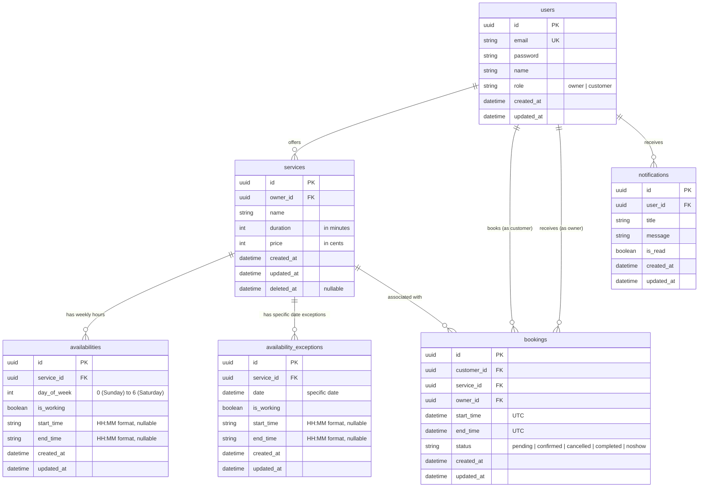

# BookSlot System Design Document

This document outlines the architectural decisions, database models, API specifications, authentication flow, edge-case handling, and testing strategy for **BookSlot**, an appointment booking platform.

---

## 1. Database Schema

The database is built on **PostgreSQL** using **Prisma ORM**. To keep user management simple and centralized while maintaining strict role separation, we employ a unified `users` model.



### Table Definitions & Fields

#### 1. `users` Table
Holds both Business Owners and Customers.
*   `id`: `UUID` (Primary Key)
*   `email`: `VARCHAR(255)` (Unique index, normalized to lowercase)
*   `password`: `VARCHAR(255)` (Bcrypt hashed password)
*   `name`: `VARCHAR(100)`
*   `role`: `VARCHAR(20)` (value is `'owner'` or `'customer'`)
*   `created_at` & `updated_at`: `TIMESTAMP`

#### 2. `services` Table
Services offered by Business Owners.
*   `id`: `UUID` (Primary Key)
*   `owner_id`: `UUID` (Foreign Key to `users.id`, cascades on delete, index)
*   `name`: `VARCHAR(100)`
*   `duration`: `INTEGER` (Duration of service in minutes, e.g. 30, 60)
*   `price`: `INTEGER` (Price stored in cents to prevent floating point inaccuracies, e.g. $15.50 = 1550)
*   `created_at` & `updated_at`: `TIMESTAMP`
*   `deleted_at`: `TIMESTAMP` (Nullable; used for soft delete to preserve historical booking data)

#### 3. `availabilities` Table
Defines weekly working hours for each Service.
*   `id`: `UUID` (Primary Key)
*   `service_id`: `UUID` (Foreign Key to `services.id`, cascades on delete, index)
*   `day_of_week`: `INTEGER` (Values 0 to 6 representing Sunday to Saturday)
*   `is_working`: `BOOLEAN` (Indicates if the service is open/offered on this day of the week)
*   `start_time`: `VARCHAR(5)` (HH:MM format, e.g. "09:00", nullable)
*   `end_time`: `VARCHAR(5)` (HH:MM format, e.g. "17:00", nullable)
*   `created_at` & `updated_at`: `TIMESTAMP`

#### 4. `availability_exceptions` Table
Defines specific calendar overrides for services.
*   `id`: `UUID` (Primary Key)
*   `service_id`: `UUID` (Foreign Key to `services.id`, cascades on delete, index)
*   `date`: `TIMESTAMP` (The specific override date)
*   `is_working`: `BOOLEAN` (True if open on this date, false if closed)
*   `start_time`: `VARCHAR(5)` (HH:MM format, nullable)
*   `end_time`: `VARCHAR(5)` (HH:MM format, nullable)
*   `created_at` & `updated_at`: `TIMESTAMP`

#### 5. `bookings` Table
Holds reservations made by Customers.
*   `id`: `UUID` (Primary Key)
*   `customer_id`: `UUID` (Foreign Key to `users.id`, restrict delete)
*   `service_id`: `UUID` (Foreign Key to `services.id`, restrict delete)
*   `owner_id`: `UUID` (Foreign Key to `users.id`, restrict delete, index)
*   `start_time`: `TIMESTAMP` (UTC start date and time)
*   `end_time`: `TIMESTAMP` (UTC end date and time, auto-calculated as `start_time + service.duration`)
*   `status`: `VARCHAR(20)` (value is `'pending'`, `'confirmed'`, `'cancelled'`, `'completed'`, or `'noshow'`)
*   `created_at` & `updated_at`: `TIMESTAMP`

#### 6. `notifications` Table
Stores notifications for owners and customers.
*   `id`: `UUID` (Primary Key)
*   `user_id`: `UUID` (Foreign Key to `users.id`, cascades on delete, index)
*   `title`: `VARCHAR(255)` (The brief title of the notification)
*   `message`: `TEXT` (The notification body description)
*   `is_read`: `BOOLEAN` (Indicates read status, default is false)
*   `created_at` & `updated_at`: `TIMESTAMP`

---

### Database Schema Design Justifications
1.  **Unified User Model with lowercase role column**: Simplifies authorization guards and JWT validation. Since owners and customers share basic properties (name, email, credentials), single-table inheritance is the cleanest design pattern.
2.  **Price in Cents**: Avoids decimal precision issues inherent in float/double types when adding, subtracting, or rendering currency totals.
3.  **Soft Service Deletion (`deleted_at`)**: Essential so that existing appointments do not crash when pulling their service info, but ensures new customers cannot find or book the service.
4.  **Redundant `owner_id` in Booking**: Denormalized to quickly query a business owner's upcoming schedule without performing a JOIN through the `services` table, and ensures we can enforce owner conflict prevention.
5.  **Per-Service Availability and Exception Overrides**: Links availability directly to `services` so owners can customize hours per service. Allows setting specific exception dates to handle holiday closures or one-off working slots.
6.  **Notifications System**: Keeps track of alerts for bookings and cancellations to keep users informed in real-time.

---

## 2. API Surface

All API responses follow a consistent JSON format enforced by a global `HttpExceptionFilter`:
- **Success**: Return raw object/array or wrapped JSON.
- **Errors**:
```json
{
  "statusCode": 400,
  "timestamp": "2026-07-15T10:30:00.000Z",
  "path": "/api/bookings",
  "message": "Error details or array of validation errors",
  "error": "Bad Request"
}
```

### Authentication & Profiles
*   `POST /api/auth/register`
    *   **Access**: Public
    *   **Body**: `{ "email": "string", "password": "safe_password", "name": "Name", "role": "owner | customer" }`
    *   **Response**: `201 Created` with the registered user profile (excluding password).
*   `POST /api/auth/login`
    *   **Access**: Public
    *   **Body**: `{ "email": "string", "password": "safe_password" }`
    *   **Response**: `200 OK` with `{ "token": "JWT_TOKEN", "user": { ... } }`.

### Services (Owner Only for Write Operations)
*   `POST /api/services`
    *   **Access**: Registered `OWNER`
    *   **Body**: `{ "name": "Haircut", "duration": 30, "price": 2500, "availabilities": [...] }`
    *   **Response**: `201 Created` with created service object.
*   `GET /api/services`
    *   **Access**: Registered `OWNER` (returns owned services with availabilities + exceptions) / `CUSTOMER` (returns all active services with owner name)
    *   **Response**: `200 OK` with service array.
*   `PATCH /api/services/:id`
    *   **Access**: Registered `OWNER` (must own the service). `:id` must be a valid UUID v4.
    *   **Body**: `{ "name"?: "New Name", "duration"?: 45, "price"?: 3000, "availabilities"?: [...] }`
    *   **Guard**: If `duration` changes and active future bookings exist, returns `400 Bad Request`.
    *   **Response**: `200 OK` with updated service object.
*   `DELETE /api/services/:id`
    *   **Access**: Registered `OWNER` (must own the service). `:id` must be a valid UUID v4.
    *   **Response**: `200 OK` with soft-deleted confirmation details.

### Availability Exceptions (Owner Only)
*   `GET /api/services/:id/exceptions`
    *   **Access**: Registered `OWNER` (must own the service)
    *   **Response**: `200 OK` with list of all date exceptions for the service.
*   `POST /api/services/:id/exceptions`
    *   **Access**: Registered `OWNER` (must own the service)
    *   **Body**: `{ "date": "YYYY-MM-DD", "is_working": true, "start_time": "10:00", "end_time": "14:00" }`
    *   **Response**: `201 Created` with the created exception.
*   `DELETE /api/services/:id/exceptions/:exId`
    *   **Access**: Registered `OWNER` (must own the service)
    *   **Response**: `200 OK` with deletion confirmation.

### Bookings (Customer & Owner Operations)
*   `GET /api/bookings/available-slots`
    *   **Access**: Any authenticated user
    *   **Query Params**: `serviceId` (UUID v4, required), `date` (YYYY-MM-DD, required)
    *   **Response**: `200 OK` with list of free ISO-8601 start times: `["2026-07-20T09:00:00.000Z", ...]`
*   `POST /api/bookings`
    *   **Access**: Registered `CUSTOMER`
    *   **Body**: `{ "serviceId": "UUID", "startTime": "2026-07-20T10:00:00.000Z" }`
    *   **Response**: `201 Created` with booking object.
*   `GET /api/bookings/my`
    *   **Access**: Registered `CUSTOMER`
    *   **Query Params**: `serviceId` (optional UUID to filter)
    *   **Response**: `200 OK` with customer's own bookings.
*   `PATCH /api/bookings/:id/cancel`
    *   **Access**: Registered `CUSTOMER` (must be the booking owner). `:id` must be a valid UUID v4.
    *   **Response**: `200 OK` with booking status marked as `'cancelled'`.
*   `GET /api/bookings/owner`
    *   **Access**: Registered `OWNER`
    *   **Response**: `200 OK` returning all upcoming (pending/confirmed) bookings for their services.
*   `GET /api/bookings/owner/all`
    *   **Access**: Registered `OWNER`
    *   **Response**: `200 OK` returning all bookings (past + future) for their services.
*   `GET /api/bookings/owner/stats`
    *   **Access**: Registered `OWNER`
    *   **Response**: `200 OK` with `{ todayBookings, weekBookings, weekRevenue, totalRevenue, activeServices }`.
*   `PATCH /api/bookings/:id/owner-status`
    *   **Access**: Registered `OWNER` (must own the booking's service). `:id` must be a valid UUID v4.
    *   **Body**: `{ "status": "confirmed | cancelled | completed | noshow" }`
    *   **Response**: `200 OK` with updated booking.
*   `PATCH /api/bookings/:id/owner-cancel`
    *   **Access**: Registered `OWNER` (must own the booking's service). `:id` must be a valid UUID v4.
    *   **Response**: `200 OK` with booking status marked as `'cancelled'`.
*   `GET /api/bookings/service/:serviceId/blocks`
    *   **Access**: Any authenticated user. `:serviceId` must be a valid UUID v4.
    *   **Query Params**: `startDate` (YYYY-MM-DD, required), `endDate` (YYYY-MM-DD, required)
    *   **Response**: `200 OK` with `[{ start_time, end_time, status }]` for all booked/blocked slots.

### Notifications
*   `GET /api/notifications` — Returns all notifications for the logged-in user.
*   `GET /api/notifications/unread-count` — Returns count of unread notifications.
*   `PATCH /api/notifications/read-all` — Marks all user notifications as read.
*   `PATCH /api/notifications/:id/read` — Marks a single notification as read.

---

## 3. Authentication & Authorization Design

1.  **JWT Authentication**:
    *   Upon login, the server issues a signed JWT containing payload: `{ "sub": userId, "email": userEmail, "role": userRole }`.
    *   The JWT token has a configurable expiry time (e.g. 1 day).
2.  **NestJS Strategy Implementation**:
    *   `JwtStrategy` extracts the token from the header: `Authorization: Bearer <token>`.
    *   If valid, the user object is attached to `req.user`.
3.  **Role Separation Guards**:
    *   `RolesGuard` reads metadata annotated via `@Roles(Role.OWNER)` or `@Roles(Role.CUSTOMER)`.
    *   If the user's role in the JWT token does not match the metadata list, the request is rejected with `403 Forbidden`.
4.  **Resource Ownership Guard**:
    *   For resource-specific mutations (such as updating a service, cancelling a booking), the service level explicitly checks that the database record's `ownerId` or `customerId` matches `req.user.id`.

---

## 4. Edge Cases & Business Rules Handling

### 1. Concurrent Bookings (Double Booking Prevention)
*   **Problem**: Two customers attempt to book the exact same slot at the exact same millisecond.
*   **Handling**:
    1.  The `createBooking` transaction runs at `Serializable` PostgreSQL isolation level (`Prisma.TransactionIsolationLevel.Serializable`).
    2.  Within the transaction, we first query conflicting bookings:
        ```sql
        SELECT * FROM "bookings"
        WHERE "service_id" = :serviceId
          AND "status" IN ('pending', 'confirmed')
          AND "start_time" < :newBookingEndTime
          AND "end_time" > :newBookingStartTime;
        ```
    3.  If a conflict exists, a `409 Conflict` exception is thrown immediately.
    4.  If two requests execute simultaneously and both pass the initial conflict check, PostgreSQL's Serializable isolation detects the read/write dependency and aborts one transaction with error code `P2034`, which the global `HttpExceptionFilter` translates into a `409 Conflict` response.

### 2. Bookings Outside Business Hours & Days
*   **Problem**: A customer tries to book a slot when the owner is closed or on a weekend.
*   **Handling**:
    1.  The booking service determines the day of the week from the requested UTC `startTime`.
    2.  It retrieves the owner's `Availability` schedules for that specific `dayOfWeek`.
    3.  It verifies that the requested `startTime` and calculated `endTime` are completely within the boundaries of at least one defined availability window. If not, it throws a `400 Bad Request` exception.

### 3. Cancellation Boundaries
*   **Problem**: A customer cancels a booking that is already in the past, or marked as completed.
*   **Handling**:
    1.  The application ensures that only bookings with a status of `CONFIRMED` or `PENDING` can be cancelled.
    2.  The application compares the current server time to the booking `startTime`. Cancellations are only allowed if the booking start time is in the future. Otherwise, a `400 Bad Request` is returned.

### 4. Service / Availability Mutated Under Active Bookings
*   **Problem**: An owner deletes a service or changes business hours when bookings already exist.
*   **Handling**:
    1.  **Service Deletion**: We soft-delete the service using a `deletedAt` field. The booking remains valid and links to the service, but the service is hidden from future searches.
    2.  **Availability Update**: Changing availability does not retroactively cancel existing bookings. However, new bookings are restricted according to the updated schedule.

### 5. Access Control Violations
*   **Problem**: Owner A tries to complete a booking belonging to Owner B. Customer A tries to cancel Customer B's booking.
*   **Handling**:
    *   The service checks the database record and validates ownership (`booking.customerId === req.user.id` or `booking.ownerId === req.user.id`). If false, a `403 Forbidden` exception is thrown.

### 6. Validation of Past Dates & Time Boundaries
*   **Problem**: Customer tries to book a slot yesterday.
*   **Handling**:
    *   The booking route checks if `startTime` is less than `Date.now() + 15 minutes` (preventing last-second bookings in the past or present).

### 7. Slot Grid Alignment
*   **Problem**: A customer submits an arbitrary start time like `09:17` for a 30-minute service that starts at `09:00`.
*   **Handling**:
    *   Before creating a booking, the service calculates `offset = startTime - windowStart`. If `offset % serviceDuration !== 0`, the request is rejected with `400 Bad Request` (e.g., `"Slot must align to the 30-minute grid starting from 09:00"`).
    *   This ensures all bookings fall exactly on the same grid as the `GET /api/bookings/available-slots` response.

### 8. Service Duration Changed Under Active Bookings
*   **Problem**: An owner changes a service's duration from 30 to 60 minutes when existing confirmed bookings are scheduled.
*   **Handling**:
    *   The `PATCH /api/services/:id` handler counts active future bookings (`pending` or `confirmed` with `start_time >= now`).
    *   If any exist, the request returns `400 Bad Request` with a message indicating how many bookings must be resolved first.
    *   This prevents slot boundary corruption where previously valid 30-minute slots would be split or overlap under a new 60-minute grid.

---

## 5. Error Response Format

All errors are formatted consistently by the global `HttpExceptionFilter` registered in `main.ts`:

```json
{
  "statusCode": 400,
  "timestamp": "2026-07-15T10:30:00.000Z",
  "path": "/api/bookings",
  "message": "Slot must align to the 30-minute grid starting from 09:00.",
  "error": "Bad Request"
}
```

Prisma database errors are also mapped:
| Prisma Code | HTTP Status | Scenario |
|---|---|---|
| `P2002` | `409 Conflict` | Duplicate unique field (e.g., email on register) |
| `P2025` | `404 Not Found` | Record not found during update/delete |
| `P2034` | `409 Conflict` | Serializable transaction abort due to concurrent booking |

---

## 6. Assumptions

1.  **Standard UTC Time Storage**: All booking times are stored in UTC in the database. The client is responsible for local timezone formatting.
2.  **Slot Grid Definition**: Available slots are generated at `service.duration`-minute intervals within the owner's availability window (e.g., a 30-min service open from 09:00 to 17:00 yields slots at 09:00, 09:30 … 16:30).
3.  **Booking Duration Consistency**: A booking lasts exactly the duration of the associated service at creation time. Changing duration later is blocked by the active-bookings guard.
4.  **Exception Priority**: Specific date exceptions always override weekly availability. If an exception marks a day as closed, no bookings can be created even if weekly availability says open.
5.  **Notification Fan-out**: Every booking lifecycle event (creation, confirmation, cancellation, completion, no-show) triggers at least one notification to the affected party within the same database transaction.

---

## 7. Testing Strategy

### Unit Tests (`src/bookings/bookings.service.spec.ts`)

All 27 unit tests run without a live database using Jest with a fully mocked `PrismaService`.

| Method | Test Cases |
|---|---|
| `createBooking` | Success + notifications; NotFoundException (no service); BadRequest (past); BadRequest (15-min buffer); BadRequest (closed day); BadRequest (outside hours); BadRequest (off-grid slot); ConflictException (double-book); Exception override |
| `getAvailableSlots` | Normal open day (16 slots); Closed day (0 slots); Booked slot filtered out; Exception override (closed); NotFoundException; Invalid date format |
| `cancelBooking` | Success + owner notified; NotFoundException; ForbiddenException (wrong customer); BadRequest (already cancelled); BadRequest (already completed); BadRequest (past booking) |
| `updateOwnerBookingStatus` | Confirm pending; ForbiddenException (wrong owner); BadRequest (invalid status); BadRequest (completing future booking); Success completing past booking; NotFoundException |

```bash
# Run all unit tests from the backend directory
npm run test
```
